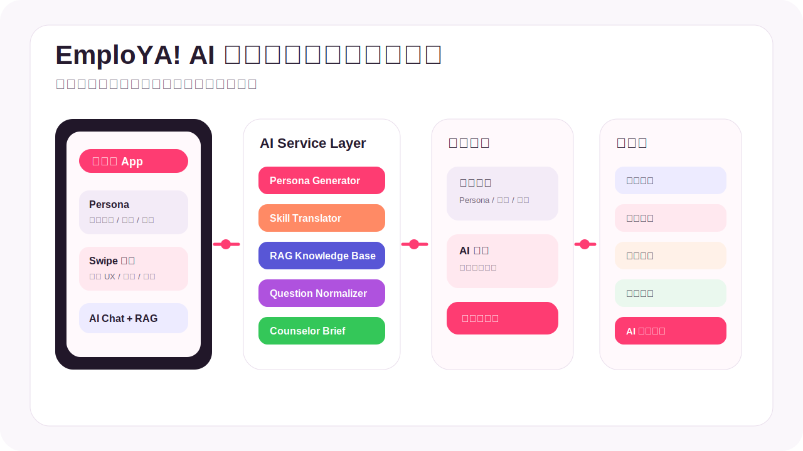

# EmploYA!

> 把迷惘變成下一步。

**賽題分類**：賽題 B · 行善台北  
**團隊**：sigmaalpha67  
**作品定位**：AI 青年職涯與創業個案服務平台  
**目標使用者**：台北青年、第一線諮詢師、青年政策單位



## 30 秒看懂這個專案

EmploYA! 做了一套 AI 青年職涯與創業服務流程，給「不知道自己適合什麼、也不知道下一步該找誰」的青年使用。系統會透過基本建檔、滑動探索、技能翻譯與 AI 問答，形成可閱讀的 Persona 與個人化 To-do List；當問題需要真人協助時，後端會產生諮詢師接手資訊，政策端也能看到去識別化的青年需求趨勢。

主要功能：

- **Persona 生成**：把 Profile、興趣、經驗與困惑整理成可讀的個人輪廓。
- **滑動探索**：用右滑/左滑蒐集職涯偏好，動態更新 Persona。
- **技能翻譯**：把社團、課堂、打工與活動經驗轉成職場能力與履歷句。
- **AI Chat + RAG**：回答政策、補助、課程、創業資源與 FAQ，並標示檢索來源。
- **諮詢師接手**：把模糊問題正規化，整理成諮詢師可快速理解的個案資訊。
- **政策儀表板**：彙整熱門問題、職涯趨勢、技能缺口、創業需求與政策建議。

## Demo 入口

本專案可完整本機 Demo：

| 入口 | URL |
|---|---|
| 青年端 Flutter App | `http://127.0.0.1:8081` |
| Backend Health Check | `http://localhost:3001/api/health` |
| 政策端 Dashboard | `http://localhost:3001/admin/dashboard` |
| 諮詢師端 Web | `http://localhost:3001/counselor` |

> Demo 登入：若沒有設定 Supabase，前端會走 mock login。輸入任一合法 email 與 4 碼以上密碼即可進入。

## 快速啟動

### 1. 啟動後端

```powershell
cd backend
npm install
npm run dev
```

後端預設跑在：

```txt
http://localhost:3001
```

### 2. 設定 AI 金鑰

後端會讀取：

```txt
backend/.env.local
```

必要或建議環境變數：

```env
GEMINI_API_KEY=your-gemini-api-key
GEMINI_MODEL=gemini-2.5-flash
```

Supabase 是 optional。若未設定 Supabase，系統會使用 in-memory demo store，仍可完整展示主要流程。

### 3. 啟動 Flutter Web

在專案根目錄執行：

```powershell
flutter pub get
flutter run -d chrome `
  --web-hostname 127.0.0.1 `
  --web-port 8081 `
  --dart-define=EMPLOYA_API_BASE_URL=http://localhost:3001
```

打開：

```txt
http://127.0.0.1:8081
```

## 現場 3-5 分鐘 Demo 劇本

建議不要從登入開始講，直接展示最有感的結果。

1. **直接秀 Persona**：小安是社會系大三，想找實習但不知道文組能力怎麼轉換。
2. **滑動探索**：右滑 UX Research、行銷企劃、資料分析助理，左滑不感興趣職務。
3. **Persona 更新**：展示系統把偏好轉成興趣方向、優勢與技能缺口。
4. **技能翻譯**：輸入「辦過迎新、做過課堂訪談報告」，產生活動企劃、訪談、資料整理與履歷句。
5. **To-do List**：展示 UX Research / 資料分析入門路徑與任務。
6. **AI Chat + RAG**：問「我文組是不是不好找工作？」或「想學資料分析有沒有課程補助？」展示 AI 根據知識庫回答。
7. **諮詢師與政策端**：切到後台/儀表板，說明如何把個案與趨勢提供給第一線人員與政策單位。

## 系統架構

```txt
Flutter 青年端 App
  ├─ Auth / Onboarding
  ├─ Persona
  ├─ Swipe Explore
  ├─ Skill Translator
  ├─ To-do List
  ├─ AI Chat
  └─ Policy Dashboard
        ↓ HTTP API
Next.js Backend
  ├─ User / Profile / Persona API
  ├─ Swipe / Skill / Plan API
  ├─ Chat / RAG / Knowledge API
  ├─ Counselor API
  ├─ Startup API
  └─ Admin Dashboard API
        ↓
AI Service Layer
  ├─ Gemini Chat
  ├─ RAG Answer Generator
  ├─ Question Normalizer
  ├─ User Insight Generator
  ├─ Counselor Brief Generator
  ├─ Persona Generator
  ├─ Skill Translator
  └─ Startup Analyzer
        ↓
Data Layer
  ├─ In-memory demo store
  └─ Optional Supabase write-through
```

## 技術選型

| 區塊 | 技術 | 用途 |
|---|---|---|
| 青年端 | Flutter / Dart | 跨平台 App 與 Web Demo |
| 前端狀態 | SharedPreferences + AppRepository | 本地快取、離線 fallback、API 同步 |
| 後端 | Next.js 15 / TypeScript | API routes、後台頁面、Server-side dashboard |
| AI | Gemini API + local fallback | Chat、RAG 回答、問題正規化、使用者洞察 |
| RAG | Knowledge seed + chunk search | 政策、課程、補助、創業資源、FAQ 檢索 |
| 資料層 | In-memory store + Supabase optional | 黑客松快速 Demo 與後續持久化擴充 |
| 管理端 | Next.js Web | 諮詢師端與政策端 dashboard |

## 主要目錄

```txt
sigmaalpha67/
├── lib/                         # Flutter app
│   ├── screens/                 # App 頁面
│   ├── services/                # BackendApi / AppRepository / Supabase config
│   ├── logic/                   # 前端 fallback 邏輯
│   ├── data/                    # 職涯卡片、興趣、補助等靜態資料
│   └── models/                  # Profile / Persona / Plan / Chat models
│
├── backend/                     # Next.js backend
│   ├── src/app/api/             # API routes
│   ├── src/app/counselor/       # 諮詢師端 Web
│   ├── src/app/admin/           # 政策端 Web dashboard
│   ├── src/engines/             # AI / RAG / Persona / Skill engines
│   ├── src/data/                # mock / seed data
│   ├── src/lib/                 # auth / db / store / route helpers
│   └── src/types/               # TypeScript types
│
├── supabase/migrations/         # Supabase schema migrations
└── jobs_img/                    # 職涯卡片圖片素材
```

## API 摘要

| 模組 | API |
|---|---|
| Auth | `POST /api/auth/login`, `POST /api/auth/register`, `POST /api/auth/refresh` |
| Profile | `GET /api/users/me/profile`, `PUT /api/users/me/profile` |
| Persona | `GET /api/persona`, `POST /api/persona/generate`, `POST /api/persona/refresh` |
| Swipe | `GET /api/swipe/cards`, `POST /api/swipe/record`, `GET /api/swipe/summary` |
| Skill | `POST /api/skills/translate`, `POST /api/skills/save` |
| Plan | `POST /api/plan/generate`, `PUT /api/plan/todos/:key` |
| Chat | `POST /api/chat/messages`, `POST /api/chat/normalize` |
| RAG | `POST /api/rag/query`, `POST /api/rag/index`, `POST /api/rag/reindex` |
| Knowledge | `POST /api/knowledge`, `GET /api/knowledge/search` |
| Counselor | `POST /api/counselor/cases`, `GET /api/counselor/cases`, `PUT /api/counselor/cases/:caseId/reply` |
| Admin | `GET /api/admin/dashboard/*`, `POST /api/admin/dashboard/policy-suggestions` |

## RAG 如何運作

```txt
使用者提問
   ↓
判斷是否需要查政策 / 補助 / 課程 / 創業 / FAQ
   ↓
搜尋 Knowledge Base
   ↓
取回相關 chunks
   ↓
Gemini 根據檢索內容回答
   ↓
回傳答案、來源、信心分數、是否建議諮詢師介入
```

目前知識庫包含：

- 台北青年職涯與實習資源
- 課程與補助資訊
- 創業貸款、創業空間、創業諮詢
- 青年常見 FAQ
- 諮詢師可回存的知識來源

種子資料位置：

```txt
backend/src/data/knowledgeBase.ts
```

## 資料來源

- YTP 2026 黑客松賽題 B：行善台北補充資料
- 臺北市青年局政府公開網站資訊
- 專案內整理的 mock policy / course / startup / FAQ knowledge base
- 使用者互動資料：Profile、Swipe、Skill Translation、Chat、To-do 狀態

## 評分亮點對照

| 評分面向 | 對應亮點 |
|---|---|
| 技術 25% | Flutter + Next.js API + Gemini + RAG + Supabase write-through |
| 創新 25% | Persona 文字化、滑動探索、技能翻譯、問題正規化、諮詢師接手包 |
| 體驗 20% | 青年用低門檻互動完成探索，不需要一開始就知道自己要問什麼 |
| 主題契合 20% | 對應行善台北：青年服務、第一線人員輔助、政策端趨勢洞察 |
| 落地 10% | 支援 demo store，也預留 Supabase 持久化與後台管理擴充 |

## Smoke Test

後端啟動後可用 PowerShell 測試：

```powershell
Invoke-RestMethod http://localhost:3001/api/health
```

測試 RAG：

```powershell
$body = @{
  question = "我想學資料分析，有沒有適合初學者的課程或補助？"
  topK = 3
} | ConvertTo-Json

Invoke-RestMethod `
  -Method Post `
  -Uri http://localhost:3001/api/rag/query `
  -Headers @{ Authorization = "Bearer demo-user" } `
  -ContentType "application/json" `
  -Body $body
```

測試 Chat：

```powershell
$body = @{
  message = "我文組是不是不好找工作？"
  context = @{
    mode = "career"
    useRag = $true
  }
} | ConvertTo-Json -Depth 5

Invoke-RestMethod `
  -Method Post `
  -Uri http://localhost:3001/api/chat/messages `
  -Headers @{ Authorization = "Bearer demo-user" } `
  -ContentType "application/json" `
  -Body $body
```

## 初選前 Checklist

- [ ] README 第一屏可在 30 秒內看懂作品。
- [ ] 賽題分類標示為「賽題 B · 行善台北」。
- [ ] 至少有一張展示圖或實機截圖。
- [ ] Backend 已啟動，`/api/health` 通過。
- [ ] Flutter App 已用固定 port `8081` 開好。
- [ ] Demo 帳號已登入並完成小安 persona。
- [ ] AI Chat 已測過一題 RAG 問題。
- [ ] 政策端 Dashboard 分頁已開好。
- [ ] 瀏覽器字體放大，通知關閉。

## 目前限制與後續擴充

- 目前 MVP 以 in-memory store 為主，Supabase 為 optional write-through。
- RAG 現階段使用 seed knowledge base 與簡易語意檢索，後續可升級為 Supabase pgvector。
- Dashboard 部分資料可使用 mock fallback，正式版應改為完整行為資料彙整。
- 諮詢師端可再補更完整的 case workflow、分流與權限管理。

## 建議 GitHub Topics

```txt
ytp2026, taipei, public-service, youth, career, startup,
ai, rag, gemini, flutter, nextjs, supabase
MPLOYA_API_TOKEN=demo-user
```
