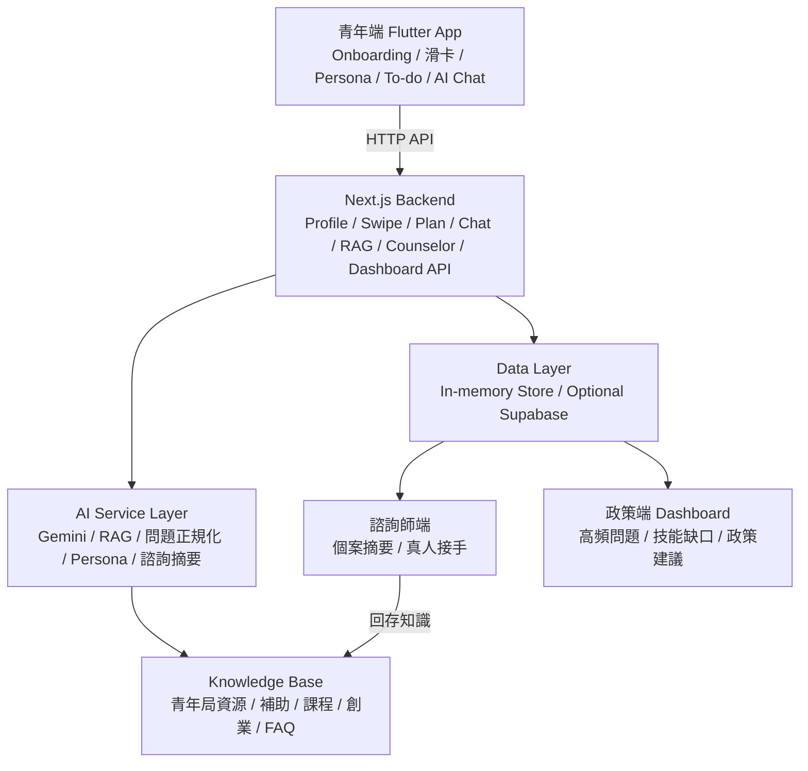

# EmploYA !


> ❤️🔥青年職涯導遊 - 從探索到行動🔥❤️

**賽題 B**：行善台北<br>
**團隊**：第8隊 尖銳吉吉今晚吃吉<br>
**作品定位**：AI 青年職涯與創業個案服務平台<br>
**目標使用者**：台北青年、第一線諮詢師、青年政策單位

## 解決甚麼問題

EmploYA ! 不只是一個資訊平台或聊天機器人，而是一款同時服務**青年**、**諮詢師**與**政府機構**三端的 AI 個案服務系統，達到解決三者負擔多贏的局面。<br>
我們做了**技能翻譯**、**滑動式興趣探索**、依照使用者興趣擬合個人化 **To-Do List** 等功能，給迷茫的求職青年及創業者，解決「不知道下一步該做什麼」的問題，一步一步帶領青年從探索到行動。<br>

主要功能：

- **技能翻譯**：將文組青年經歷轉譯為職場可用的軟實力。
- **職涯探索**：
  - **滑動探索**：右滑/左滑蒐集職涯偏好，讓青年能輕鬆接收資訊，並動態更新 Persona。
  - **個人化職涯路徑**：依興趣及個人目標生成 To-Do List，並可客製化調整，引領青年在職涯中一步步前進。
  - **AI Chat + RAG**：串Gemini API 結合 RAG 政府資料，同時提供使用者情緒支持及需要資源連結。
- **諮商師與公部門**：
  - **諮詢師接手**：把模糊問題正規化，整理成諮詢師可快速理解的重點；並將不同種類的問題分配給對應專業的諮詢師。
  - **政策儀表板**：彙整熱門問題、職涯趨勢、創業需求與政策建議等，讓政府機關快速了解目前青少年問題、生成詳細報告與 AI 自動化建議。

## Demo 影片


## 系統架構





## 快速啟動

### 1. 啟動後端

```powershell
cd backend
npm install
npm run dev
```

後端預設跑在：

```txt
http://localhost:3001
```

### 2. 設定 AI 金鑰

後端會讀取：

```txt
backend/.env.local
```

必要或建議環境變數：

```env
GEMINI_API_KEY=your-gemini-api-key
GEMINI_MODEL=gemini-2.5-flash
```

Supabase 是 optional。若未設定 Supabase，系統會使用 in-memory demo store，仍可完整展示主要流程。

### 3. 啟動 Flutter Web

在專案根目錄執行：

```powershell
flutter pub get
flutter run -d chrome `
  --web-hostname 127.0.0.1 `
  --web-port 8081 `
  --dart-define=EMPLOYA_API_BASE_URL=http://localhost:3001
```

打開：

```txt
http://127.0.0.1:8081
```


## 功能列表


| 功能            | 使用者價值                                       | Demo 看點                                 | 主要路徑 / 檔案                                                  |
| --------------- | ------------------------------------------------ | ----------------------------------------- | ---------------------------------------------------------------- |
| Onboarding      | 用幾個低負擔問題初步了解青年狀態                 | 小圖建立學校、科系、年級、就業 / 創業意向 | `lib/screens/onboarding_screen.dart`                             |
| 首頁            | 集中每日一題、青年補助與核心功能入口             | 進入系統後看到每日一題與青年求職補助連結  | `lib/screens/home_screen.dart`                                   |
| 滑卡探索        | 主動提供職涯資訊，降低「不知道該搜尋什麼」的門檻 | 右滑 / 左滑職涯卡，蒐集偏好               | `lib/screens/explore_screen.dart`                                |
| Persona         | 將背景、興趣、優勢與技能缺口整理成可讀輪廓       | 小圖滑卡後 Persona 被更新                 | `lib/screens/persona_screen.dart`                                |
| 技能翻譯        | 把課堂、社團、打工經驗轉成職場能力與履歷句       | 「辦迎新、做訪談報告」轉成職場技能        | `lib/screens/skill_translator_screen.dart`                       |
| 職涯 To-do List | 把迷惘拆成可執行的週任務                         | 依 Persona 與滑卡偏好產生行動計畫         | `lib/screens/career_path_screen.dart`                            |
| AI Chat + RAG   | 回答職涯、補助、課程、創業與 FAQ 問題            | 查詢台北青年資源，並提供脈絡化回答        | `lib/screens/chat_screen.dart`, `backend/src/app/api/rag/*`      |
| 諮詢師接手      | 將 AI 無法完整處理的問題整理給真人接手           | 問題正規化、個案摘要、諮詢師可快速理解    | `backend/src/app/counselor/*`, `backend/src/app/api/counselor/*` |
| 政策 Dashboard  | 彙整去識別化需求，協助政策端看見趨勢             | 高頻問題、技能缺口、熱門職涯與政策建議    | `backend/src/app/admin/dashboard/*`                              |


## 技術棧


| 區塊     | 技術                                | 用途                                        | 評分亮點                                                  |
| -------- | ----------------------------------- | ------------------------------------------- | --------------------------------------------------------- |
| 青年端   | Flutter / Dart                      | 建置青年端 App 與 Web Demo                  | 可完整展示 Onboarding、滑卡、Persona、To-do、AI Chat 流程 |
| UI 風格  | Cupertino UI                        | 提供接近 App 的操作體驗                     | 互動直覺，適合現場 Demo                                   |
| 前端狀態 | SharedPreferences + AppRepository   | 本地快取、API 同步、fallback                | Demo 不會因後端或網路不穩完全中斷                         |
| 後端     | Next.js 15 / TypeScript             | API routes、諮詢師端、政策 Dashboard        | 不是純前端 mock，有完整資料流                             |
| AI       | Gemini API                          | AI 回答、技能翻譯、Persona / To-do 輔助生成 | 讓系統具備個人化與自然語言理解能力                        |
| RAG      | Knowledge Base + chunk search       | 檢索青年局資源、補助、課程、創業與 FAQ      | 回答能扣回台北青年資源，不是泛用聊天                      |
| 資料層   | In-memory store + optional Supabase | 黑客松 Demo 與後續持久化擴充                | 可本機展示，也保留正式落地路徑                            |
| 管理端   | Next.js Web Dashboard               | 諮詢師接手與政策洞察                        | 支援青年、諮詢師、政策單位三端閉環                        |


## 團隊與分工


| 工作流               | 負責內容                                                           | 分工           |
| -------------------- | ------------------------------------------------------------------ | -------------- |
| 產品敘事與使用者旅程 | 小圖 persona、問題定義、Demo 主線、五大評分維度對應                | 宋宇倫、姜睿喆 |
| Flutter 青年端       | Onboarding、首頁、滑卡探索、Persona、技能翻譯、To-do List、AI Chat | 陳芃慈、       |
| 後端 API             | Profile、Swipe、Plan、Chat、RAG、Knowledge、Counselor、Admin API   | 陳鼎元、許晉誠 |
| AI / RAG             | Gemini 串接、RAG 檢索、問題正規化、Persona / 諮詢摘要生成          | 陳鼎元、宋宇倫 |
| 諮詢師端             | 個案列表、問題摘要、使用者脈絡、接手流程                           | 許晉誠         |
| 政策端               | 高頻問題、技能缺口、職涯趨勢、創業需求、AI 政策建議                | 姜睿喆         |
| Demo 與決選文件      | 預錄影片、投影片 PDF、README、Q&A 準備                             | 陳芃慈         |
